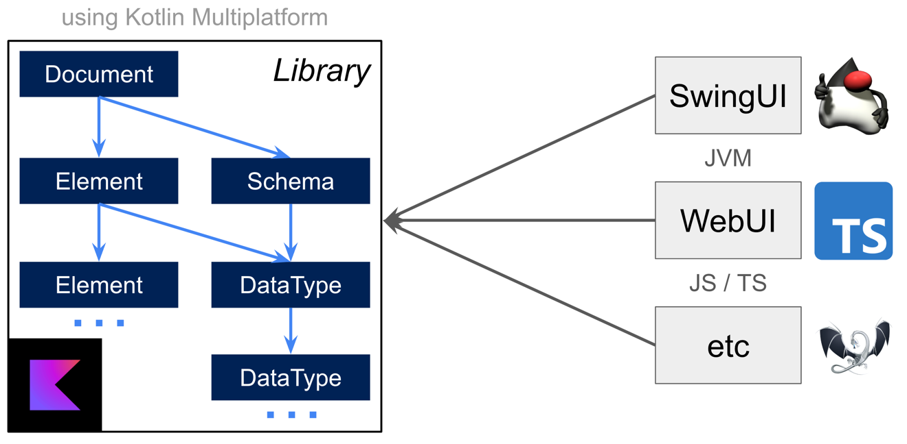

## JSON Schema Fusion

A multiplatform library that allows:
1. Parse JSON Schema specification
2. Annotate JSON file with information from the specification
3. Use it to draw beautiful user interfaces which are user-friendly!

## Architecture



## How to use it

1. Build library:
    * JVM: `./gradlew jvmJar`
    * NPM: `./gradlew jsNodeProductionLibraryDistribution`
2. Include it to the project
3. Implement [DocumentVisitor.kt](core/src/commonMain/kotlin/ru/itmo/json_forms/core/document/DocumentVisitor.kt). This
   visitor calls with JSON descriptor nodes. You shall use them to implement UI on the target platform. See 
   [IntelliJ Plugin example](intellij-plugin/src/main/kotlin/ru/itmo/hson_forms/intellij/ui/JsonEditorComponent.kt) in 
   kotlin or [VS Code Extension example in Type Script](vscode-plugin).
4. Get the `Document` with `JsonTreeBuilder.build(<json>, <schema>)` call. You can also pass
   `prettyPrintJson = false` to disable pretty-printing

## IntelliJ Idea Plugin


You can run IntelliJ Idea with the plugin that way:
```shell
./gradlew :intellij-plugin:runIde
```

Also, you can build it:

```shell
./gradlew :intellij-plugin:buildPlugin
```

## VS Code Plugin

You can open in VS Code and do all needed stuff 
